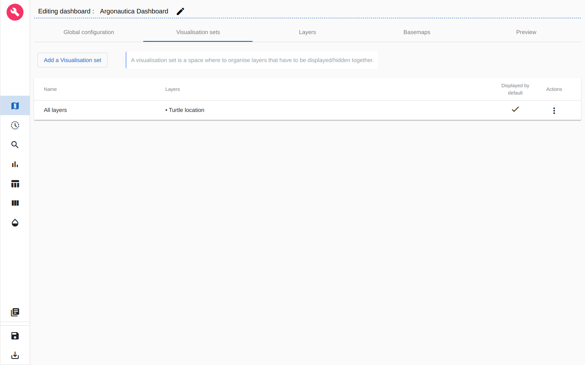
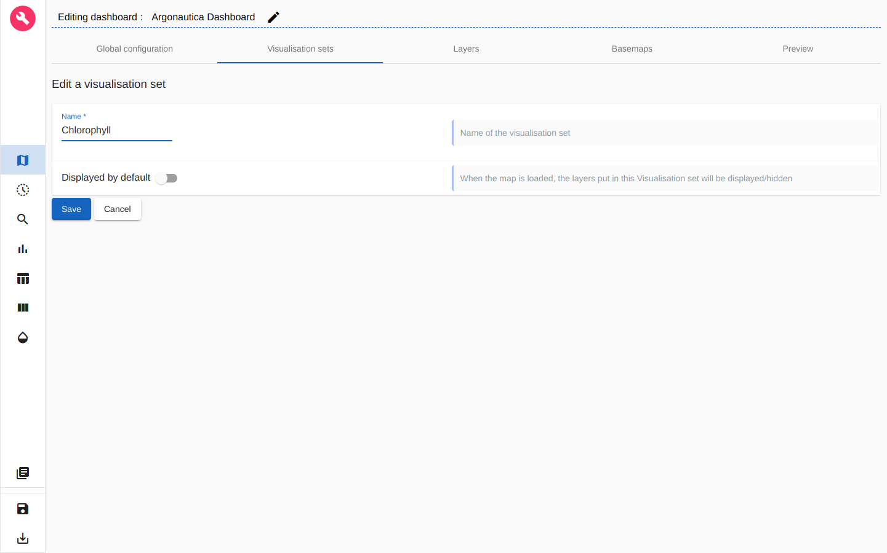
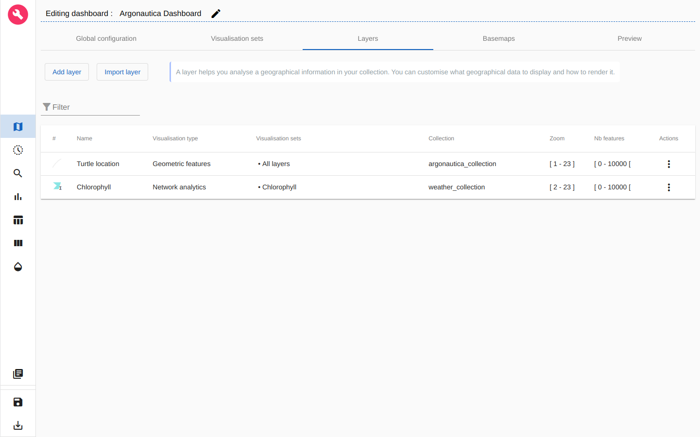
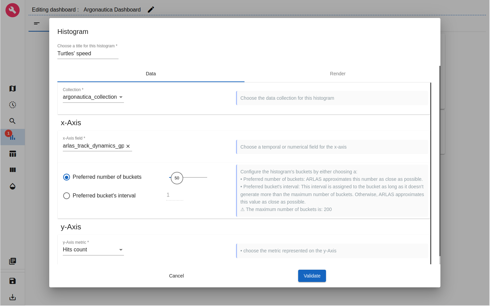

# ARLAS workshop Argonautica

* [ARLAS workshop Argonautica](#arlas-workshop-argonautica)
   * [Introduction](#introduction)
   * [What will you learn?](#what-will-you-learn)
   * [Prepare the workshop](#prepare-the-workshop)
   * [What will you get?](#what-will-you-get)
* [Argonautica and weather data](#argonautica-and-weather-data)
   * [Argonautica data](#argonautica-data)
   * [Marine weather data](#marine-weather-data)
* [Exploring multiple collections at once](#exploring-multiple-collections-at-once)
   * [Indexing and loading data into ARLAS](#indexing-and-loading-data-into-arlas)
      * [Setup](#setup)
      * [Starting ARLAS Exploration Stack](#starting-arlas-exploration-stack)
      * [Indexing data in Elasticsearch](#indexing-data-in-elasticsearch)
         * [Argonautica data](#argonautica-data-1)
         * [Weather data](#weather-data)
      * [Declaring argonautica_index and weather_index in ARLAS](#declaring-argonauticaindex-and-weatherindex-in-arlas)
   * [Creating a dashboard to explore Argonautica data with ARLAS](#creating-a-dashboard-to-explore-argonautica-data-with-arlas)
      * [Choosing the collection](#choosing-the-collection)
      * [Map configuration](#map-configuration)
      * [Timeline configuration](#timeline-configuration)
      * [Search bar configuration](#search-bar-configuration)
      * [Save the dashbord and start exploring in ARLAS-wui](#save-the-dashbord-and-start-exploring-in-arlas-wui)
      * [Analytics board](#analytics-board)
      * [Geo Big Data](#geo-big-data)
* [The final words](#the-final-words)


## Introduction

This workshop's aim is to present ARLAS's capabilities to explore big volumes of geo-spatial data using an analytic and geo-analytic approach through the cross study of loggerhead turtles' movements and climate conditions. It is a deeper dive into the data that was presented during [the talk at the 2022 GeoDataDays]().

In [the first part](#argonautica-and-weather-data) of the workshop, we present which data sets we will use, as well as the processes that led to the final data that will be explored in this workshop.

In [the second part](#exploring-multi-collection-data), we will then explore data of :

- Loggerhead turtles' movements from the [CNES educational program Argonautica](https://enseignants-mediateurs.cnes.fr/fr/enseignants-et-mediateurs/projets/argonautica)
- Marine weather data from the [Copernicus Marine Service platform](https://resources.marine.copernicus.eu/products) 

This example helps you go through the different steps to start exploring data with ARLAS :
- Studying the data and make it analytics ready
- Starting the ARLAS-stack and reference the data in ARLAS
- Building dashboards with map layers and widgets
- Exploring the data.

<br/>

## What will you learn?
With this tutorial, you'll be able to:

- Start an ARLAS-Exploration stack
- Index some Argos and weather data in Elasticsearch
- Reference the indexed data in ARLAS
- Create a view of ARLAS-wui (a dashboard) to explore the impact of climate conditions on loggerhead turtles' movements using ARLAS-wui-hub and ARLAS-wui-builder

## Prepare the workshop

- The workshop is prepared to be run under Linux / Mac OSX operating system.
- You will need to have `docker` and `docker-compose` installed
- You will need `curl` for http requests and to download some tools for the workshop

## What will you get?

With this workshop, you will discover how to add data to ARLAS, as well as create an ARLAS dashboard to explore this data.

<br/>

<p align="center">
    
</p>
<p align="center" style="font-style: italic;">
figure 0: Example of view thanks to the created dashboard
</p>

<br/>

# Argonautica and weather data

## Argonautica data

Let's explore some animal tracking data.

We built a dataset composed of 3 loggerhead turtles' movements between 2018 and 2021 from the [CNES educational program Argonautica](https://enseignants-mediateurs.cnes.fr/fr/enseignants-et-mediateurs/projets/argonautica). From the communicated positions, we added information regarding their movements (speed, trail, ...) as well as the climate conditions they encountered by interpolating those values from the un-merged global weather data set that we constitued as explain in the next section.

This subset is stored in `argonautica_data.csv`. It contains __8 755__ positions described with the following columns:

- class: if not 'G' indicates the precision range of an Argos measure. If 'G', the measure is a GPS one.
- dateHour; lat; lon: temporal and geospatial coordinates of the record
- name: name of the loggerhead turtle
- point_geom: the position in WKT format
- timestamp: the UNIX timestamp of the measure. It is used to indicate the temporality of the measure to ARLAS as seen in the `argonautica_collection.json`
- trail_id: the unique ID of this record
- trail_geom: the WKT line linking this point and the next one
- gps_speed: the computed GPS speed
- gps_bearing: the computed GPS orientation
- current_speed; current_angle; SLA; SST; CHL: climate conditions interpolated from the weather dataset
- dayOfYear; weekOfYear; month; year: helpers for the representation of periodic temporal data

The content of a line of the csv file looks like:

|class|lat|lon|name|type|dateHour|point_geom|timestamp|trail_id|trail_geom|gps_speed|gps_bearing|current_speed|current_angle|SLA|SST|CHL|dayOfYear|weekOfYear|month|year|
|---|---|---|---|---|---|---|---|---|---|---|---|---|---|---|---|---|---|---|---|---|
|B|37.7233|-0.0592|Gloria|Loggerhead turtle|2021/05/05 10:14|POINT(-0.0592 37.7233)|1620201690|Gloria#1620200940_1620202440|LINESTRING (-0.0585 37.7254, -0.0592 37.7233)|0.5786710530504017|194.82992333596488|0.0890163012627082|55.2911825117637|0.0357612146212001|18.053640347593728|0.1463965331146449|125|18|5|2021|

<br/>

## Marine weather data

The weather dataset is built by associating [Copernicus](https://resources.marine.copernicus.eu/products) datasets composed of data that could be useful to understand loggerhead turtles movements. In order to obtain the weather data set that is in this workshop, the following process was applied:

- Retrieve the interesting data sets form the Copernicus platform
- Because of the download size limit, piece together each data set
- Complete them with other data sets with the same variables to reach the maximum coverage possible
- Interpolate them to a common temporal and spatial grid
- Merge them together
- From the Argonautica data selected, extract the daily bounding boxes that encompass the turtles movements, with a certain margin
- Add to the data set the geometry of the cell that the weather record represent

This subset is stored in `weather_data.csv`. It contains around __57 199__ processed weather records described with the following columns:

- date; latitude; longitude: temporal and geospatial coordinates of the record
- SLA: Sea Level Anomaly, or the difference in height between the avergae global sea height and the measured one ($m$)
- SST: Sea Surface Temperature ($°C$)
- chl: the quantity of chlorophyll measured ($mg/m^3$)
- current_angle: the angle of the average surface currents ($°$)
- current_speed: the speed of the average surface currents ($m/s$)
- timestamp: the UNIX timestamp of the measure. It is used to indicate the temporality of the measure to ARLAS as seen in the `weather_collection.json`
- unique_id: the unique ID of this record
- dayOfYear; weekOfYear; month_name; year: helpers for the representation of periodic temporal data
- point_geom: the position in WKT format
- box_geom: the WKT polygon representing the cell of the grid on which the data has been interpolated
- location_id: an ID formed of `longitude_latitude`, common to a grid cell to cluster measures of a same position together in `Network analytics` layers

The content of a line of the csv file looks like:

|date|latitude|longitude|SLA|SST|chl|current_angle|current_speed|timestamp|unique_id|dayOfYear|weekOfYear|month_name|year|point_geom|box_geom|location_id|
|---|---|---|---|---|---|---|---|---|---|---|---|---|---|---|---|---|
|2018-07-03|46.167|-2.833|0.023||0.084|-9.319|0.028|1530568800|46.167_-2.833_1530568800|184|27|July|2018|POINT(-2.833 46.167)|POLYGON((-2.875 46.125,-2.875 46.209,-2.791 46.209,-2.791 46.125,-2.875 46.125))|-2.833_46.167|

<br/>

# Exploring multiple collections at once

## Indexing and loading data into ARLAS

Now that we discovered what the data represents and looks like, we will explore it through ARLAS. But before that, we need to load the data into ARLAS.

### __Setup__

Before diving into the exploration of the data, we need to retrieve the data, as well as the ARLAS stack itself, by following the steps below.

- Create a repository dedicated to this tutorial

```shell
mkdir ARLAS-argonautica-workshop
cd ARLAS-argonautica-workshop
```

- Download the turtles' movements and weather data

```shell
curl -o weather_data.csv -L "https://raw.githubusercontent.com/gisaia/ARLAS-argonautica-workshop/master/data/weather_data.csv"

curl -o argonautica_data.csv -L "https://raw.githubusercontent.com/gisaia/ARLAS-argonautica-workshop/master/data/argonautica_data.csv"
```

- Check that both data files are downloaded

```shell
ls -l weather_data.csv
ls -l argonautica_data.csv
```

- Download the ARLAS-Exploration-stack project and unzip it

```shell
(curl -L -O "https://github.com/gisaia/ARLAS-Exploration-stack/archive/develop.zip"; unzip develop.zip; rm develop.zip)
```

- Check that the `ARLAS-Exploration-stack-develop` stack is downloaded

```shell
ls -l ARLAS-Exploration-stack-develop
```

Now our tutorial environment is set up.

<br/>

### __Starting ARLAS Exploration Stack__

The ARLAS stack is composed of multiple entities that work together to allow the user to efficiently explore geo-spatial data. To start all of them, we execute the following script.

```shell
./ARLAS-Exploration-stack-develop/start.sh
```

*Troubleshooting: if the ARLAS stack does not start properly and you are on Linux, try the following command to increase the virtual memory given to Elasticsearch.*

```shell
sysctl -w vm.max_map_count=262144
```
<br/>

### __Indexing data in Elasticsearch__

Once the stack is launched, we can use Elasticsearch and Logstash to index and upload the data into ARLAS.

#### __Argonautica data__

- Create `argonautica_index` index in Elasticsearch with `argonautica.es_mapping.json` mapping file

```shell
curl "https://raw.githubusercontent.com/gisaia/ARLAS-argonautica-workshop/master/configs/argonautica.es_mapping.json" |
curl -XPUT "http://localhost:9200/argonautica_index/?pretty" \
    -d @- \
    -H 'Content-Type: application/json'
```

You can check that the index is successfuly created by running the following command

```shell
curl -XGET "http://localhost:9200/argonautica_index/_mapping?pretty"
```

- Index data that is in `argonautica_data.csv` in Elasticsearch. 

For that, we need Logstash as a data processing pipeline that ingests data in Elasticsearch. Logstash needs a configuration file (`argonautica2es.logstash.conf`) that indicates how to transform data from the CSV file and to index it in Elasticsearch.


```shell
curl "https://raw.githubusercontent.com/gisaia/ARLAS-argonautica-workshop/master/configs/argonautica2es.logstash.conf" \
    -o argonautica2es.logstash.conf
```

Now we will use Logstash in order to apply the data model transformation and to index data in Elasticsearch given the `argonautica2es.logstash.conf` configuration file with the docker image `docker.elastic.co/logstash/logstash` :

```shell
network=$(docker network ls --format "table {{.Name}}" | grep arlas[-_]exploration)

cat argonautica_data.csv | docker run -e XPACK_MONITORING_ENABLED=false \
    --net ${network} \
    --env ELASTICSEARCH=elasticsearch:9200  \
    --env INDEXNAME=argonautica_index --rm -i \
    -v ${PWD}/argonautica2es.logstash.conf:/usr/share/logstash/pipeline/logstash.conf docker.elastic.co/logstash/logstash:7.17.4
```

- Check if __8755__ turtle locations are indexed:

```shell
curl -XGET http://localhost:9200/argonautica_index/_count?pretty
```
<br/>

#### __Weather data__

- Create `weather_index` index in Elasticsearch with `weather.es_mapping.json` mapping file

```shell
curl "https://raw.githubusercontent.com/gisaia/ARLAS-argonautica-workshop/master/configs/weather.es_mapping.json" |
curl -XPUT "http://localhost:9200/weather_index/?pretty" \
    -d @- \
    -H 'Content-Type: application/json'
```

You can check that the index is successfuly created by running the following command

```shell
curl -XGET "http://localhost:9200/weather_index/_mapping?pretty"
```

- Index data that is in `weather_data.csv` in Elasticsearch. For that, we need Logstash as a data processing pipeline that ingests data in Elasticsearch. Logstash needs a configuration file (`weather2es.logstash.conf`) that indicates how to transform data from the CSV file and to index it in Elasticsearch.


```shell
curl "https://raw.githubusercontent.com/gisaia/ARLAS-argonautica-workshop/master/configs/weather2es.logstash.conf" \
    -o weather2es.logstash.conf
```

- Now we will use Logstash in order to apply the data model transformation and to index data in Elasticsearch given the `weather2es.logstash.conf` configuration file with the docker image `docker.elastic.co/logstash/logstash` :

```shell
network=$(docker network ls --format "table {{.Name}}" | grep arlas[-_]exploration)

cat weather_data.csv | docker run -e XPACK_MONITORING_ENABLED=false \
    --net ${network} \
    --env ELASTICSEARCH=elasticsearch:9200  \
    --env INDEXNAME=weather_index --rm -i \
    -v ${PWD}/weather2es.logstash.conf:/usr/share/logstash/pipeline/logstash.conf docker.elastic.co/logstash/logstash:7.17.4
```

- Check if __57 199__ weather measures are indexed:

```shell
curl -XGET http://localhost:9200/weather_index/_count?pretty
```
<br/>

### __Declaring `argonautica_index` and `weather_index` in ARLAS__

ARLAS-server interfaces with data indexed in Elasticsearch via a collection reference.

The collection references an identifier, a timestamp, and geographical fields which allows ARLAS-server to perform a spatial-temporal data analysis

- Create an Argonautica collection in ARLAS

```shell
curl "https://raw.githubusercontent.com/gisaia/ARLAS-argonautica-workshop/master/configs/argonautica_collection.json" | \
curl -X PUT \
    --header 'Content-Type: application/json;charset=utf-8' \
    --header 'Accept: application/json' \
    "http://localhost:81/server/collections/argonautica_collection?pretty=true" \
    --data @-
```

- Check that the collection is created using the ARLAS-server `collections/{collection}`

```shell
curl -X GET "http://localhost:81/server/collections/argonautica_collection?pretty=true"
```

<br/>

Now we repeat the same process for the weather data.

- Create a weather collection in ARLAS

```shell
curl "https://raw.githubusercontent.com/gisaia/ARLAS-argonautica-workshop/master/configs/weather_collection.json" | \
curl -X PUT \
    --header 'Content-Type: application/json;charset=utf-8' \
    --header 'Accept: application/json' \
    "http://localhost:81/server/collections/weather_collection?pretty=true" \
    --data @-
```

- Check that the collection is created using the ARLAS-server `collections/{collection}`

```shell
curl -X GET "http://localhost:81/server/collections/weather_collection?pretty=true"
```
<br/>

## Creating a dashboard to explore `Argonautica data` with ARLAS

ARLAS stack is up and running, we have both Argonautica and weather data available for exploration. We can now create our first dashboard composed of:
- a map to observe the turtles' locations, the positions' geographical distribution and the weather data
- a timeline presenting the number of positions and weather measures over time
- a search bar to look for turtles by their names for instance
- some widgets to analyse the data from another axis such as the turtles' speed or the temperature they are experiencing

To do so, let's go to ARLAS-wui-hub at http://localhost:81/hub and create a new dashboard named `Argonautica dashboard`.

<p align="center">
    
</p>
<p align="center" style="font-style: italic;">
figure 1: Creation of a dashboard in ARLAS-wui-hub
</p>

After clicking on __Create__, you are automatically redirected to ARLAS-wui-builder to start configuring your dashboard.

<br/>

### __Choosing the collection__

The first thing we need to do is to tell ARLAS which collection of data we want to use to create our dashboard.

<p align="center">
    
</p>
<p align="center" style="font-style: italic;">
figure 2: Choose collection
</p>

In our case we will choose the `argonautica_collection` as our main collection, but we will have the opportunity to add the `weather_collection` further along.

<br/>

### __Map configuration__

As a first step, we set the map at zoom level 3 and the map's center coordinates at Latitude=15° and Longitude=10°. This way, when loading the dashboard in ARLAS-wui, the map will cover the extent of the turtles positions: from the Atlantic to the Indian Ocean. 

<p align="center">
    
</p>
<p align="center" style="font-style: italic;">
figure 3: Map initialisation
</p>

For now, the map is empty. __The first thing we want to find out is where the turtles are passing by.__

<p align="center">
    
</p>
<p align="center" style="font-style: italic;">
figure 4: Layers view
</p>

To do so, let's add a <b>Geometric Features</b> layer named `Turtle location` to visualise the trajectory associated to each turtle on the map.

In the `Geometry` section ($1^{st}$ section), choose _arlas_track_trail_ as the features geo-field.

<p align="center">
    
</p>
<p align="center" style="font-style: italic;">
figure 5: Adding a <b>Geometric Features</b> layer named 'Turtle location'
</p>

Now, let's define the layer's style. As a starter, we choose the best representation of our geometries: a turtle's track is a line. We choose a **solid line** with a color generated by the _name_ of each turtle. We choose the width of the track to be interpolated by the time that each turtle has spent moving since being tagged, to get a sense of the direction in which they are moving.  

<p align="center">
    
</p>
<p align="center" style="font-style: italic;">
figure 6: Customizing 'Turtle location' style: colored line based on the turtle's name
</p>

In order to be able to visualise all of the turtles positions, we increase the limit of features that this layer can display to **10 000**.

<p align="center">
    
</p>
<p align="center" style="font-style: italic;">
figure 7: Customizing 'Turtle location' visibility: increase the maximum of features
</p>

After clicking on __Validate__, our first layer is created.

<p align="center">
    
</p>
<p align="center" style="font-style: italic;">
figure 8: New layer 'Turtle location' is created
</p>

We can also choose the basemaps that will be available in the dashboard.

<p align="center">
    
</p>
<p align="center" style="font-style: italic;">
figure 9: Choice of Basemaps
</p>

We can go and preview the layer in `Preview` tab.

<p align="center">
    
</p>
<p align="center" style="font-style: italic;">
figure 10: Preview of 'Photo location' layer
</p>

We can now see where the turtles are thanks to this layer, as well as save a preview to be displayed in the hub.

<br/>

Since we are aiming to analyse the impact of climate conditions on the turtles' movements, we need to be able to visualise weather data. In order to facilitate their visualisation, each of the weather record has been tagged with a `location_id` in the following pattern `longitude_latitude`: this allows us to create a **Network analytics** layer, where weather records are clustered by this tag. We will create three similar layers, able to represent the variation of `chlorophyll`, `Sea Surface Temperature` and `Sea Level Anomaly` around the turtles' tracks as well as a slightly different layer for the `current` data.

<p align="center">
    
</p>
<p align="center" style="font-style: italic;">
figure 11: Visualisation set tab
</p>

In order to be able to switch between the different layers of weather data, we create a `Visualisation set` for each of them.

<p align="center">
    
</p>
<p align="center" style="font-style: italic;">
figure 12: Create a 'Visualisation set'
</p>

<p align="center">
    
</p>
<p align="center" style="font-style: italic;">
figure 13: All the created 'Visualisation set'
</p>

For the layers, we start by creating a **Network analytics** layer for the `chlorophyll` field, based on the `location_id` identifier. To do that, we have to *change collection* by selecting it under the visualisation type.

<p align="center">
    
</p>
<p align="center" style="font-style: italic;">
figure 14: Create a 'Network analytics' layer
</p>

We interpolate the color of the displayed polygon with the `chl` field.

<p align="center">
    
</p>
<p align="center" style="font-style: italic;">
figure 15: Edit the style of the 'Chlorophyll' layer
</p>

We choose the third palette to keep the green part of it, to represent well the chlorophyll of the water.

<p align="center">
    
</p>
<p align="center" style="font-style: italic;">
figure 16: Default color palette choices
</p>

To remove the unused color, just click on the minus sign on the same line. We then reorder the colors by dragging and dropping them to form a more informative layer. Finally we reset the midpoints of the colors thanks to the button situated up-top.

<p align="center">
    
    
</p>
<p align="center" style="font-style: italic;">
figure 17: Edition process of the 'Chlorophyll' color palette
</p>

To best visualise the data, we increase the maximum number of features to **10 000**.

<p align="center">
    
</p>
<p align="center" style="font-style: italic;">
figure 18: Edit the visibility parameters of the layer
</p>

We now have one layer for the turtle position, and one for the average chlorophyll measured around the turtles.

<p align="center">
    
</p>
<p align="center" style="font-style: italic;">
figure 19: 'Turtles' positions' and 'Chlorophyll' layer
</p>

The creation of the next `Network analytics` layers will allow you to explore the impact that different climate conditions can have on loggerhead turtles' movements. *You can skip them if you want to dive as soon as possible in the exploration.*

To create the layers for the `Sea Level Anomaly` and the `Sea Surface Temperature`, we repeat the same process, with different color palettes to keep as much information possible in these representations. We suggest to associate each layer to a different visualisation set that we created for more clarity.

For the `Sea Level Anomaly` layer we suggest to keep the second palette as is.

<p align="center">
    
</p>
<p align="center" style="font-style: italic;">
figure 20: Geometry of the 'Sea Level Anomaly' layer
</p>

<p align="center">
    
</p>
<p align="center" style="font-style: italic;">
figure 21: Style of the 'Sea Level Anomaly' layer
</p>

For the color palette of the `Sea Surface Temperature` layer, we suggest to shift all the colors of the first palette to red to get a monochromatic fade.

<p align="center">
    
</p>
<p align="center" style="font-style: italic;">
figure 22: Style of the 'Sea Surface Temperature' layer
</p>

Once you are done with those layers, you should have something similar to the figure below. 

<p align="center">
    
</p>
<p align="center" style="font-style: italic;">
figure 23: 'Chlorophyll', 'Sea Surface Temperature' and 'Sea Level Anomaly' layers
</p>

*Remember to change your visibility settings to **10 000** maximum features!*

For the final layer, we will represent the currents. The difference resides in how they will be displayed on the map: instead of using polygons and colors to convey the direction and intensity of those currents, we use labels.

<p align="center">
    
</p>
<p align="center" style="font-style: italic;">
figure 24: Create the 'Currents' layer
</p>

For more clarity, we disable the overlap of the black arrows that will be displayed.

<p align="center">
    
</p>
<p align="center" style="font-style: italic;">
figure 25: Edit the style of the 'Currents' layer
</p>

Once the color chosen, the arrows are all horizontal and point towards the East. To change that we interpolate their size and orientation depending on the orientation and intensity of the currents.

<p align="center">
    
</p>
<p align="center" style="font-style: italic;">
figure 26: Orientate and expand the arrows depending on the data
</p>

You can play with the other parameters of the label representation to get a fancier display. 

In the end, we obtain the 5 following layers. It already is possible to explore the data, but adding some analytics and additional information helps to bring the best out of the data.

### __Timeline configuration__

First, let's find out the time period when these positions and weather records were emitted.

For that, let's define a timeline: an histogram that will represent the number of pictures taken over time.

For the x-Axis we choose the `arlas_timestamp` field. The y-Axis represents the number of positions in each bucket. We set 50 buckets in this example. The detailed timeline appears when the selection is very precise. We set it at 50 buckets.

In order to also render the temporal distribution of the weather records, we select `weather_collection` as an additional collection.

<p align="center">
    
</p>
<p align="center" style="font-style: italic;">
figure 27: Customise the timeline
</p>

We can edit the render tab to select a curve histogram, which will allow us to see best both collections at once.

### __Search bar configuration__

To explore huge amounts of data without scrolling, the search bar can be a powerful tool. To define the search bar we can set:
- the placeholder string
- the field used to search keywords
- the field used to autocomplete the searched words

<p align="center">
    
</p>
<p align="center" style="font-style: italic;">
figure 28: Customise the 'Search' bar
</p>

### __Save the dashbord and start exploring in ARLAS-wui__

Now we defined
- the 'Turtle location' layer and weather layers in the map
- the timeline
- the search bar

Let's save this dashboard by clicking on the 'Disk' icon at the bottom-left of the page.

If we go back to ARLAS-wui-hub at http://localhost:81/hub, we'll find the `Argonautica dashboard` created.

We can now __View__ it in ARLAS-wui.

<p align="center">
    
</p>
<p align="center" style="font-style: italic;">
figure 29: Marine currents and Samson's movements
</p>

To obtain this figure with as much contrast, you can select the area with turtle tracks in the Indian Ocean thanks to the `Geo-filter tools` on the right of the map (the icon with the magnifying glass). Then by clicking on the `Map settings` above, change the operation type to `doesn't intersect`.

<p align="center">
    
</p>
<p align="center" style="font-style: italic;">
figure 30: 'Turtle location' in parallel with 'Chlorophyll'
</p>

### __Analytics board__

Now that we can visualise the turtles' tracks and a summary of the climate conditions they encountered, what's next? To add ways to explore the data and gain other insights on it, we can define different types of analytics back in the builder. We can group them by `tab` (for example by whether they are related to turtles or climate conditions), as well as by `group`.

<p align="center">
    
</p>
<p align="center" style="font-style: italic;">
figure 31: Empty analytics board
</p>

We can create a `Turtles' tracks` tab with two groups: `Turtles` and `Turtles' speed`.

By clicking on the plus button in the group, we create a `powerbar` widget that will allow us to see the proportion of each individual in the dataset.

<p align="center">
    
</p>
<p align="center" style="font-style: italic;">
figure 32: Create a group and add a 'powerbar' widget
</p>

In this widget, we want to represent which turtles are in the dataset, so we select the corresponding field for the `Powerbar field`.

<p align="center">
    
</p>
<p align="center" style="font-style: italic;">
figure 33: Create a turtles' name powerbar
</p>

In the second group, we can add a `Metric` that will display the average speed of the turtles.

<p align="center">
    
</p>
<p align="center" style="font-style: italic;">
figure 34: Create a metric
</p>

We select the average of the `arlas_track_dynamics_gps_speed` field, representing the computed GPS speed of the turtle. By pressing add, the metric is added.

<p align="center">
    
</p>
<p align="center" style="font-style: italic;">
figure 35: Edit the metric to display the turtles' average speed
</p>

We add an explanatory text as well as an unit to make the metric more understandable for others.

<p align="center">
    
</p>
<p align="center" style="font-style: italic;">
figure 36: Explain the metric
</p>

To explore the true distribution of the turtles' speed, we create an histogram of the `Hits count` (number of documents falling in a specific bucket) of `arlas_track_dynamics_gps_speed`.

<p align="center">
    
</p>
<p align="center" style="font-style: italic;">
figure 37: Create a speed histogram
</p>

Since the Argos and GPS measures have an estimated error that can go up to multiple kilometers, the GPS speed can be way higher than the real speed of loggerhead turtles, which is usually at most 10 km/h.

<p align="center">
    
</p>
<p align="center" style="font-style: italic;">
figure 38: The finished analytics
</p>

Thanks to that histogram, we can filter out absurdly high values both in the ARLAS-wui and the preview on the right of the builder. By selecting the turtles' speeds up until 15 m/s, we can have a better insight on what the true loggerhead turtle average speed is.

<p align="center">
    
</p>
<p align="center" style="font-style: italic;">
figure 39: A filtered view of Icare's trajectory and the surrounding currents
</p>

Take a look at the loop in athe middle of `Icare`'s trail, as well as to the count of the number of records that fit all the filters that have been set up-top. We can see gaps in the trail and a number of records that is lower than the initial one of 8755. This means that as turtles' positions do not fit anymore the set of filters that the user defined, they are not taken into account by other metrics, analytics or layers.

There exist many ways to filter and explore data in ARLAS, that could help you to see clearer through your mass of data, and help you save time doing the tedious task of inspecting entries of your file.

### __Geo Big Data__

For this tutorial, we only have a sample of 3 turtles to follow, among the more than __20 000__ Argos beacons that are active.

What to do in case we had millions of positions and weather records to display?

It would be very difficult to display them all at once as it would be very heavy to request all this data and the browser will not be able to render this many features. We will end up loosing the user experience fluidity.

Most importantly, loading tens or thousands or even millions of positions on the map will not be necessarily understandable: we cannot derive clear and synthesized information from it.

That's why ARLAS proposes a geo-analytic view: we can aggregate the locations to a geographical grid and obtain a geographical distribution!

Let's create a new dedicated visualisation set and layer `Turtles' positions distribution` to display the density of turtles' movements.

We choose to aggregate the `point_geom` geo-field to a geographical grid and we choose a fine granularity for this grid. We will display on the map the grid's cells.

<p align="center">
    
</p>
<p align="center" style="font-style: italic;">
figure 40: Creating a geographical distribution 'Cluster' layer
</p>

Let's define the style of these cells in `Style` section.

We interpolate the cells' color based on the number of positions in each cell. To do so, we choose a normalised __Hits count__ as our interpolation field and we then select a color palette.

<p align="center">
    
</p>
<p align="center" style="font-style: italic;">
figure 41: Styling the geographical distribution layer
</p>

We set the cell opacity at 0.7 and the stroke opacity at 0 (no need to display stroke here).

<p align="center">
    
</p>
<p align="center" style="font-style: italic;">
figure 43: All the cartographic layers created thus far
</p>

After saving this layer, we can visualise it and visualise where the turtles are geographically distributed.

<p align="center">
    
</p>
<p align="center" style="font-style: italic;">
figure 44: Photo location distribution
</p>

We have now the distribution of the turtles' entire sample. However, the distribution layer doesn't show the exact location of the turtles displayed on the right. 

# The final words

As you can see we created a simple dashboard to start exploring environmental data!

Check out a more sophisticated dashboard about the Argonautica data that explores ~70000 turtles' positions as well as ~400 000 weather records in our [demo space](https://demo.cloud.arlas.io/arlas/wui/?config_id=0Fy1OjjDK7z3564bx32q)!

You can get inspired from our different [demos](https://demo.cloud.arlas.io/) to build other map layers and other widgets.
